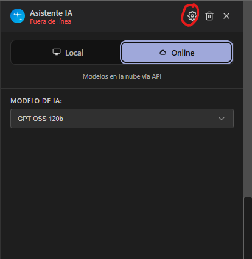
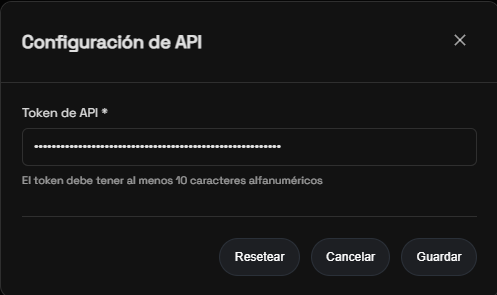

# Omega Connector

Omega Connector es una herramienta que facilita el uso de modelos de lenguaje locales (LLMs) mediante la integración con Ollama. Este README explica cómo preparar el entorno, instalar y usar Omega Connector para chatear con modelos instalados en tu equipo.

## Requisitos

- Sistema operativo compatible (Windows, Linux, macOS).
- Ollama instalado y configurado en la máquina local: https://ollama.com/download
- Modelos adecuados descargados en Ollama (revisa los requisitos de cada modelo, ya que algunos requieren hardware potente).

## Instalación de Ollama

1. Descarga Ollama desde su sitio oficial: https://ollama.com/download
2. Instala y ejecuta la aplicación.
3. Verifica que Ollama está en funcionamiento y que has descargado al menos un modelo compatible con tu hardware.

> Una vez iniciado Ollama verás su interfaz y podrás gestionar modelos que se descargan en tu máquina.
> 

## Configuración y uso de Omega Connector

1. Descarga y ejecuta el instalador que se incluye en este repositorio.

2. Abre la aplicación y pulsa "Iniciar Servidor" para levantar el backend.

3. Accede a la interfaz web "Omega Knowledge" desde tu navegador.
4. En la sección de chat selecciona el modelo que coincida con el instalado en Ollama.

En los "Logs del Sistema" se registrarán las solicitudes que Omega Connector envía a Ollama, lo que te ayudará a depurar problemas.

## Solución de problemas

Si no puedes chatear con los modelos, prueba lo siguiente:

- Actualiza o recarga la página web.
- Asegúrate de que el servidor (Omega Connector) está iniciado.
- Confirma que el modelo seleccionado en la UI coincide con uno instalado en Ollama.
- Revisa los logs para ver errores de conexión o mensajes de Ollama.

## Notas sobre rendimiento

Los modelos locales pueden requerir muchos recursos computacionales (CPU/GPU y memoria). Antes de usar modelos grandes, revisa los requisitos del modelo y la capacidad de tu equipo.

# Usando IA sin ejecutar en local

## Alternativa Groq Chat Model

Accede al sitio oficial de groq: https://console.groq.com/home. 

Sigue las siguientes instrucciones:
1. Crea una cuenta
2. Inicia sesión
3. Accede a la sección de: "Api Keys"
4. Crea una nueva API Key y copiála!
5. Dirígete a Omega Knowledge
6. En sidebar del chat selecciona el modo online, no local

7. Entra a "Configuración"

8. Pega la api key

### Limitaciones
A diferencia de la opción local, Groq Chat Model tiene limitaciones en cuanto a la cantidad de tokens que puedes usar por día. Revisa los detalles en el sitio oficial de Groq para entender las restricciones y costos asociados.